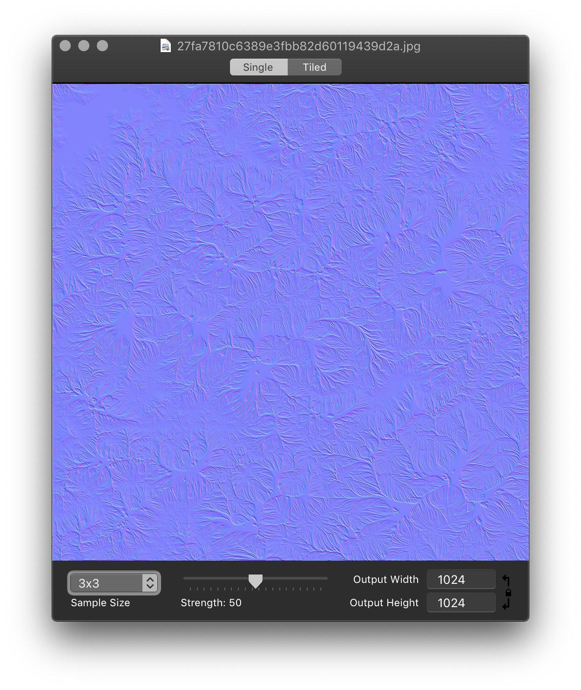
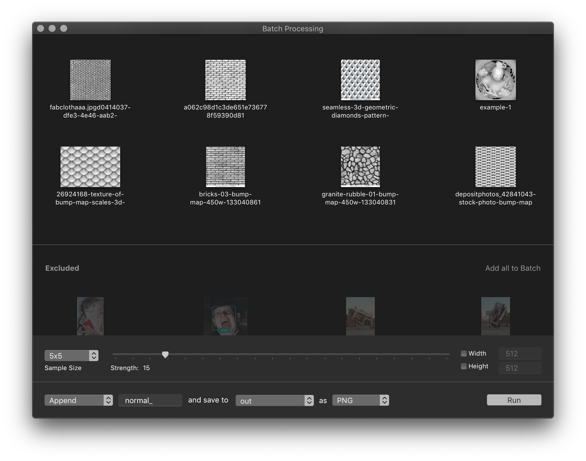

# NormalMappr
Rewrite, maintenance and feature improvmeents to a macOS normal map generator which I wrote back in 2009 or so.

Presently, **NormalMappr** is not signed or notarized, so running it will require right clicking it, selecting "Open", and then allowing macOS to launch it.

- [NormalMappr 2.0.alpha2](bin/NormalMappr.app.zip)

**NormalMappr** supports interactive normal map generation on single images:

## Batch Operation

**NormalMappr** also supports batch operation on multiple images files, or recursively on directories. In batch mode, **NormalMappr** will attempt to filter out ("exclude") images which don't appear to be bump maps. This way you can safely just drag in a folder containing a bunch of textures, and reasonably expect that just your bumpmaps will be processed. Users can move excluded images into the batch, and visa versa for false positives.

